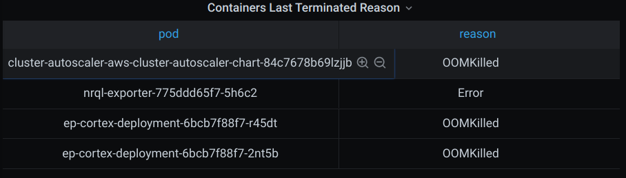
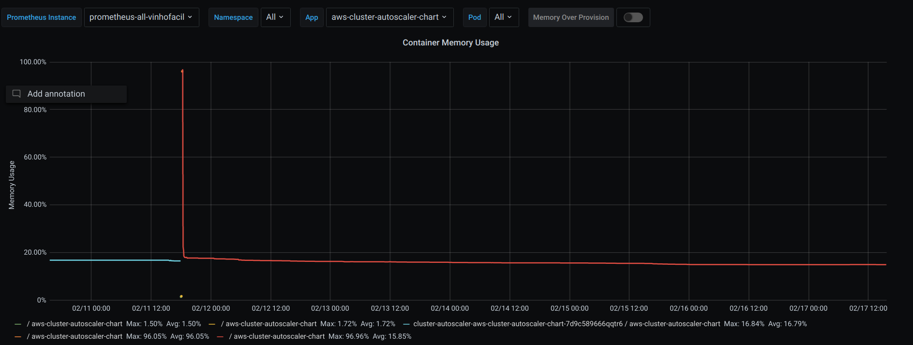
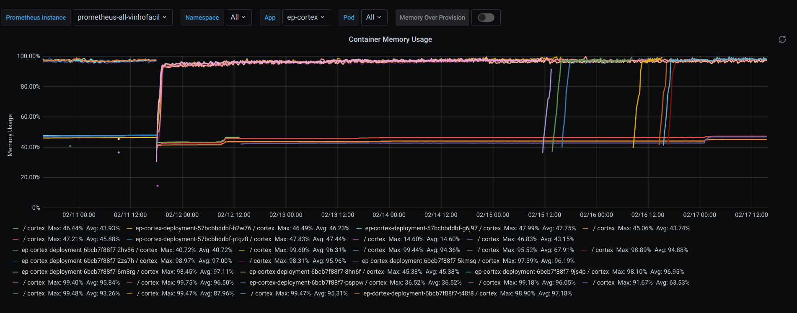
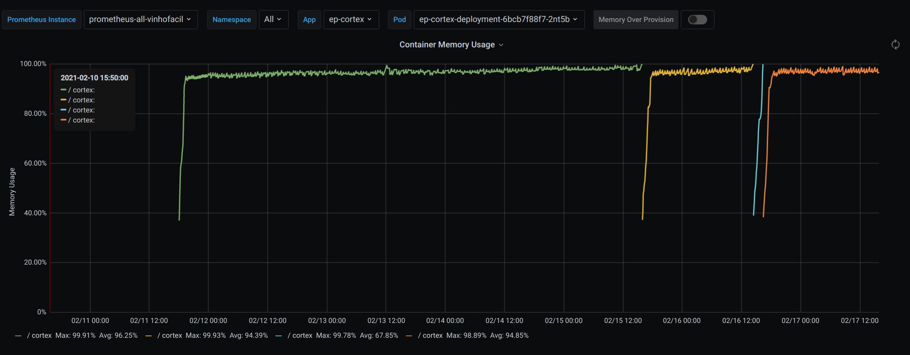
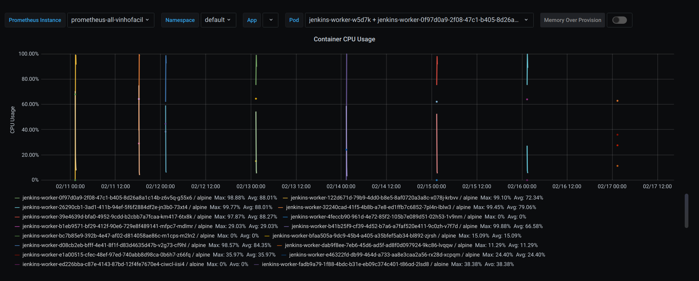
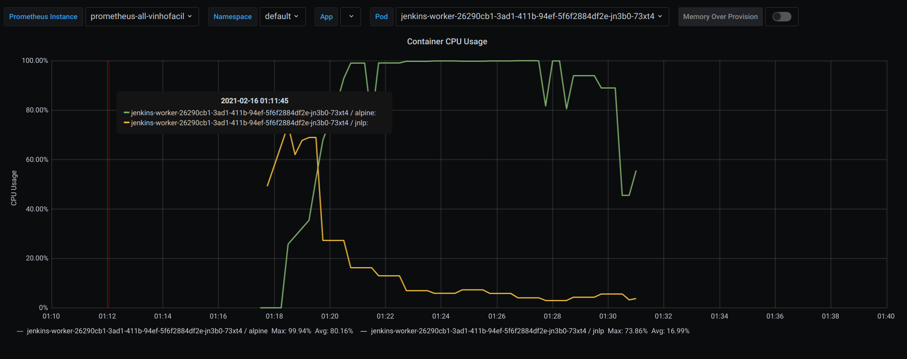

# all-vinhofacil

## Alerta: **Host OOM kill detected**

### aws-cluster-autoscaler-chart 
Observa-se que apesar de ter alertado não é um comportamento frequente desta aplicação.

Últimos 7 dias:

[visualize no grafana aqui!](http://grafana.wine.com.br/d/2CxICHeWk/deployment-detailed-view?viewPanel=2&orgId=1&refresh=30s&from=now-7d&to=now&var-prometheus_instance=prometheus-all-vinhofacil&var-namespace=All&var-app=aws-cluster-autoscaler-chart&var-pod=All)

### ep-cortex

Já na aplicação ep-cortex, observa-se que os PODS criados morrem com frequência por falta de memória.

Últimos 7 dias:

Observando melhor o comportamento de um dos PODS:

[visualize no grafana aqui!](http://grafana.wine.com.br/d/2CxICHeWk/deployment-detailed-view?viewPanel=2&orgId=1&refresh=30s&from=now-7d&to=now&var-prometheus_instance=prometheus-all-vinhofacil&var-namespace=All&var-app=ep-cortex&var-pod=All)

## Alerta: **Container CPU Usage Higher than 95% of its Limit**

- Jenkins-worker:

Observa-se então que varios pods tem um comportamento de alto uso de memória, enquanto outros tem um comportamento normal.

Últimos 7 dias: 

[visualize no grafana aqui!](http://grafana.wine.com.br/d/2CxICHeWk/deployment-detailed-view?viewPanel=3&orgId=1&refresh=30s&from=now-7d&to=now&var-prometheus_instance=prometheus-all-vinhofacil&var-namespace=default&var-pod=jenkins-worker-w5d7k&var-pod=jenkins-worker-0f97d0a9-2f08-47c1-b405-8d26a8a1c14b-z6v5q-g55x6&var-pod=jenkins-worker-26290cb1-3ad1-411b-94ef-5f6f2884df2e-jn3b0-73xt4&var-pod=jenkins-worker-32240cad-41f5-4b8b-a7e8-ed1ffb7c6852-7pl4n-lblw3&var-pod=jenkins-worker-39e4639d-bfa0-4952-9cdd-b2cbb7a7fcaa-km417-6tx8k&var-pod=jenkins-worker-b1eb9571-bf29-412f-90e6-729e8f489141-mfpc7-mdlmr&var-pod=jenkins-worker-bc7b85e9-392b-4e47-af02-d814058ae86c-m1cps-m2ln2&var-pod=jenkins-worker-122d671d-79b9-4dd0-b8e5-8af0720a3a8c-x078j-krbvv&var-pod=jenkins-worker-fadb9a79-1f88-4bdc-b31e-eb09c374c401-t86gd-2lsd8&var-pod=jenkins-worker-ed226bba-c87e-4143-87bd-12f4fe7670e4-cjwcl-jjsj4&var-pod=jenkins-worker-e46322fd-db99-464d-a733-aa8e3caa2a56-rx28d-xcpqm&var-pod=jenkins-worker-e1a00515-cfec-48ef-97ed-740abb8d98ca-0b6h7-z66fq&var-pod=jenkins-worker-dab9f8ee-7eb6-45d6-ad5f-ad8f0d097924-9kc86-lvqqw&var-pod=jenkins-worker-d08cb2eb-bfff-4e41-8f1f-d83d4635d47b-v2g73-cf9hl&var-pod=jenkins-worker-bfaa505a-9dc9-45b4-a405-a35bfef5ab34-bl892-zjrsh&var-pod=jenkins-worker-b41b25f9-cf39-4d52-b7a6-a7faf520e411-9c0zh-v7f7d&var-pod=jenkins-worker-4feccb90-961d-4e72-85f2-105b7e089d51-02h53-1v9nm)

Observando mais de perto um desses pods (em um intervalo de 40 minutos):

[visualize no grafana aqui!](http://grafana.wine.com.br/d/2CxICHeWk/deployment-detailed-view?viewPanel=3&orgId=1&from=1613448600000&to=1613450400000&var-prometheus_instance=prometheus-all-vinhofacil&var-namespace=default&var-pod=jenkins-worker-26290cb1-3ad1-411b-94ef-5f6f2884df2e-jn3b0-73xt4)
