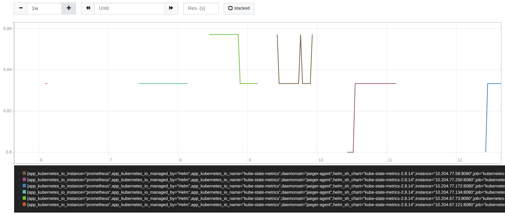
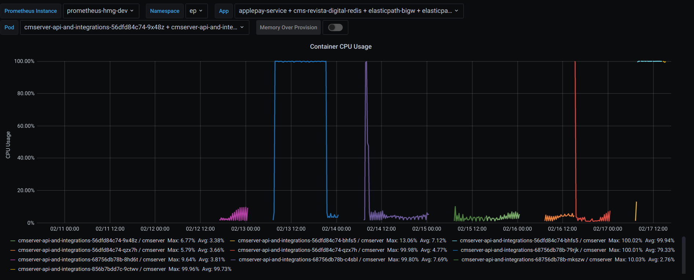
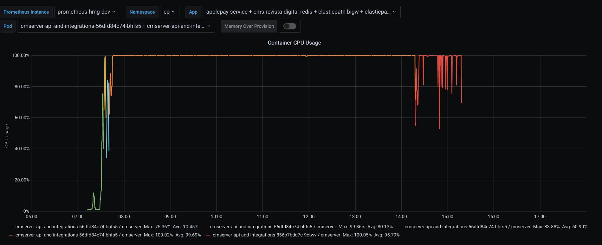
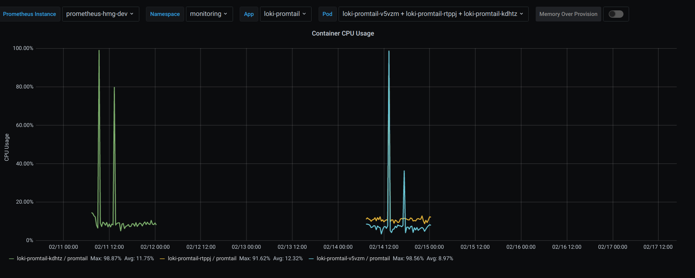
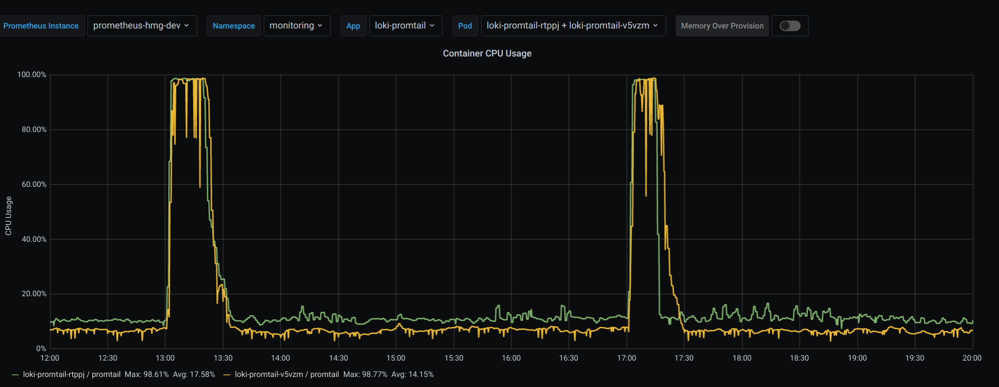
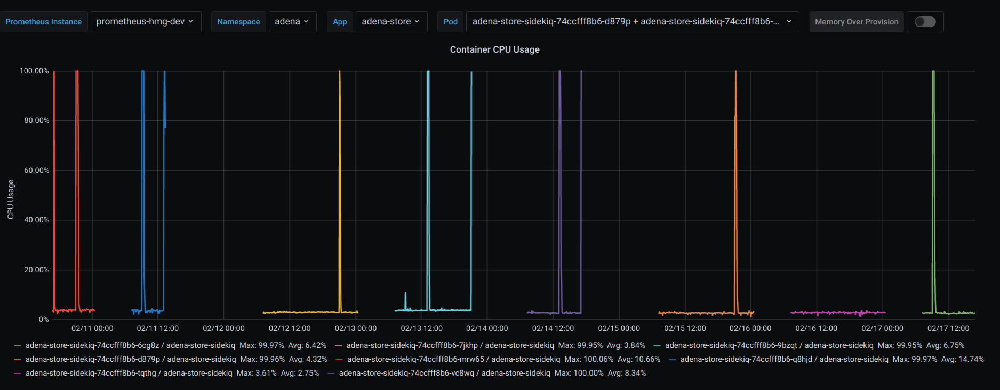
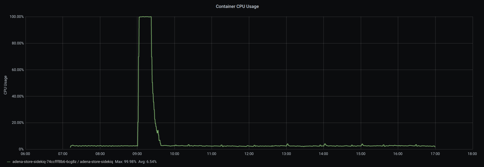

# hmg-dev

## Alerta:  **DeamonSet Rollout** | monitoring jaeger-agent

Investigando a métrica no prometheus, vimos que a função utilizada no alerta está sempre retornando algo (7h - 00h):

[Clique aqui para visualizar no Prometheus!](http://prometheus.internal.winevinhos.info/graph?g0.range_input=1h&g0.expr=kube_daemonset_status_number_ready%20%2F%20kube_daemonset_status_desired_number_scheduled%20!%3D%201%20or%20kube_daemonset_status_desired_number_scheduled%20-%20kube_daemonset_status_current_number_scheduled%20%3E%200&g0.tab=0)

[Aqui podemos visualizar o comportamento do "jaeger-agent" no grafana](http://grafana.wine.com.br/d/2CxICHeWk/deployment-detailed-view?orgId=1&refresh=30s&var-prometheus_instance=prometheus-prd-winecommerce&var-namespace=All&var-app=jaeger&var-pod=All).

## Alerta: **ReplicasSet Mismatch**

**No grafana:**

[namespace="monitoring"](http://grafana.wine.com.br/d/2CxICHeWk/deployment-detailed-view?orgId=1&refresh=30s&from=now-7d&to=now&var-prometheus_instance=prometheus-hmg-dev&var-namespace=monitoring&var-app=jaeger&var-app=jaeger-cassandra&var-pod=jaeger-query-684f9dbfc9-sk647&var-pod=jaeger-collector-5b965fdbd4-94wgx&var-pod=jaeger-collector-5b965fdbd4-s4zm9&var-pod=jaeger-collector-5b965fdbd4-642dq&var-pod=jaeger-collector-5b965fdbd4-q5s86&var-pod=jaeger-collector-5b965fdbd4-rwd5k&var-pod=jaeger-collector-5b965fdbd4-wp8nf&var-pod=jaeger-collector-5b965fdbd4-76xhv&var-pod=jaeger-collector-5b965fdbd4-ctf7g&var-pod=jaeger-collector-5b965fdbd4-8jndm&var-pod=jaeger-collector-5b965fdbd4-hck7q&var-pod=jaeger-collector-5b965fdbd4-7rj2r&var-pod=jaeger-collector-5b965fdbd4-jkjsl&var-pod=jaeger-collector-5b965fdbd4-4l6md&var-pod=jaeger-collector-5b965fdbd4-wvm5z&var-pod=jaeger-collector-5b965fdbd4-l77d4&var-pod=jaeger-collector-5b965fdbd4-tvn5q) - jaeger-query / jaeger-collector.

[namespace="ep"](http://grafana.wine.com.br/d/2CxICHeWk/deployment-detailed-view?orgId=1&refresh=30s&from=now-7d&to=now&var-prometheus_instance=prometheus-hmg-dev&var-namespace=ep&var-app=applepay-service&var-app=cms-revista-digital-redis&var-app=elasticpath-bigw&var-app=elasticpath-broker&var-app=elasticpath-cmserver&var-app=elasticpath-search&var-app=elasticpath-storefront&var-app=ep-dlq-purge-job&var-app=sql-exporter&var-app=strapi&var-pod=storefront-web-and-api-temp-6669b88ff7-8xhpp&var-pod=storefront-web-and-api-temp-6669b88ff7-c2wnf&var-pod=storefront-web-and-api-temp-6669b88ff7-42vmw&var-pod=storefront-web-and-api-temp-6669b88ff7-9d4b5&var-pod=storefront-web-and-api-temp-6669b88ff7-fknlf&var-pod=storefront-web-and-api-temp-6669b88ff7-qtb72&var-pod=storefront-web-and-api-temp-6669b88ff7-sjbbw&var-pod=storefront-web-and-api-temp-6669b88ff7-wcwg7&var-pod=storefront-web-and-api-temp-6669b88ff7-nlkr4) - storefront-web-and-api-temp.

[namespace="adena"](http://grafana.wine.com.br/d/2CxICHeWk/deployment-detailed-view?orgId=1&refresh=30s&from=now-7d&to=now&var-prometheus_instance=prometheus-hmg-dev&var-namespace=adena&var-app=adena-store&var-pod=adena-store-sidekiq-74ccfff8b6-tqthg&var-pod=adena-store-sidekiq-74ccfff8b6-mrw65&var-pod=adena-store-sidekiq-74ccfff8b6-7jkhp&var-pod=adena-store-sidekiq-74ccfff8b6-6cg8z&var-pod=adena-store-sidekiq-74ccfff8b6-vc8wq&var-pod=adena-store-sidekiq-74ccfff8b6-9bzqt&var-pod=adena-store-sidekiq-74ccfff8b6-d879p&var-pod=adena-store-sidekiq-74ccfff8b6-q8hjd) - adena-store-sidekiq. *Ao ver os outros PODS da mesma aplicação, observamos que este tem um comportamento diferente: maior crescimento do uso de memória e alguns picos do uso de CPU.*

## Alerta: **Deployment Replicas Mismatch**

Este alerta é disparado pelos mesmos pods do alerta acima nas namespaces "ep" e "adena". 

## Alerta: **HPA Unable to Collect Metrics**: storefront-web-and-api-temp

É disparado pelos mesmos pods do alerta acima, da namespace "ep".

## Alerta: **Pod not running for too long**

Este alerta foi disparado na última semana por:

- namespace="monitoring", pod="jaeger-agent-*".
- namespace="ep", pod="storefront-web-and-api-temp-*.

## Alerta: **Container CPU Usage Higher than 95% of its Limit**

### namespace="ep"

[visualize no grafana aqui!](http://grafana.wine.com.br/d/2CxICHeWk/deployment-detailed-view?orgId=1&refresh=30s&from=now-7d&to=now&var-prometheus_instance=prometheus-hmg-dev&var-namespace=ep&var-app=applepay-service&var-app=cms-revista-digital-redis&var-app=elasticpath-bigw&var-app=elasticpath-broker&var-app=elasticpath-cmserver&var-app=elasticpath-search&var-app=elasticpath-storefront&var-app=ep-dlq-purge-job&var-app=sql-exporter&var-app=strapi&var-pod=cmserver-api-and-integrations-56dfd84c74-9x48z&var-pod=cmserver-api-and-integrations-68756db78b-mkszw&var-pod=cmserver-api-and-integrations-68756db78b-79rjk&var-pod=cmserver-api-and-integrations-68756db78b-c4sbl&var-pod=cmserver-api-and-integrations-56dfd84c74-bhfs5&var-pod=cmserver-api-and-integrations-68756db78b-8hd6t&var-pod=cmserver-api-and-integrations-56dfd84c74-qzx7h&var-pod=cmserver-api-and-integrations-856b7bdd7c-9ctwv) - cmserver-api-and-integrations.

Uso de CPU da aplicação nos últimos 7 dias:

Observando mais de perto:

### namespace="monitoring"

[visualize no grafana aqui!](http://grafana.wine.com.br/d/2CxICHeWk/deployment-detailed-view?orgId=1&refresh=30s&from=now-7d&to=now&var-prometheus_instance=prometheus-hmg-dev&var-namespace=monitoring&var-app=loki-promtail&var-pod=loki-promtail-v5vzm&var-pod=loki-promtail-rtppj&var-pod=loki-promtail-kdhtz) - loki-promtail.

Uso de CPU da aplicação nos últimos 7 dias: 

Observando mais de perto em um intervalo de 12h:

### namespace="adena"

[visualize no grafana aqui!](http://grafana.wine.com.br/d/2CxICHeWk/deployment-detailed-view?orgId=1&refresh=30s&from=now-7d&to=now&var-prometheus_instance=prometheus-hmg-dev&var-namespace=adena&var-app=adena-store&var-pod=adena-store-sidekiq-74ccfff8b6-d879p&var-pod=adena-store-sidekiq-74ccfff8b6-9bzqt&var-pod=adena-store-sidekiq-74ccfff8b6-vc8wq&var-pod=adena-store-sidekiq-74ccfff8b6-6cg8z&var-pod=adena-store-sidekiq-74ccfff8b6-7jkhp&var-pod=adena-store-sidekiq-74ccfff8b6-mrw65&var-pod=adena-store-sidekiq-74ccfff8b6-tqthg&var-pod=adena-store-sidekiq-74ccfff8b6-q8hjd) - adena-store-sidekiq.

Uso de CPU da aplicação nos últimos 7 dias: 

Observando mais de perto:
