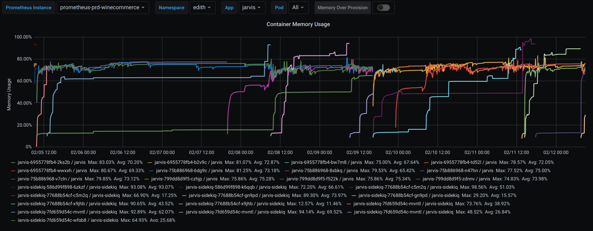
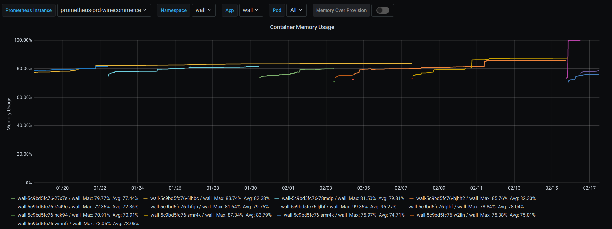

#prd-winecommerce

## Alerta: **Host OOM kill detected**

### Aplicação Jarvis

Uso de memória da aplicação jarvis nos últimos 7 dias:

[Clique aqui para visualizar no grafana!](http://grafana.wine.com.br/d/2CxICHeWk/deployment-detailed-view?viewPanel=2&orgId=1&refresh=30s&from=now-7d&to=now&var-prometheus_instance=prometheus-prd-winecommerce&var-namespace=edith&var-app=jarvis&var-pod=All)

Foi observado um padrão de crescimento de uso de memória  até um ponto em que os containers morriam, o que faz com que os alarmes estejam sempre disparando.

### Aplicação Wall:

Observou-se que outra aplicação também apresenta um comportamento parecido,porém com uma frequência menor de OOMkill.

Uso da memória da aplicação wall nos últimos 30 dias:

[Clique aqui para visualizar no grafana!](http://grafana.wine.com.br/d/2CxICHeWk/deployment-detailed-view?viewPanel=2&orgId=1&refresh=30s&from=now-30d&to=now&var-prometheus_instance=prometheus-prd-winecommerce&var-namespace=wall&var-app=wall&var-pod=All)